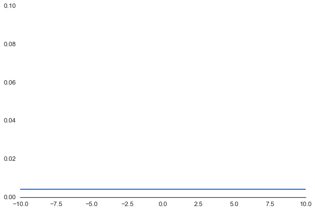

autoscale: true
theme: Letters from Sweden, 4

# Bayesian Best Practices
### Probabilistic Programming Workflow in PyMC

<br>`github.com/fonnesbeck/bayesian_workflow`


^
- mixed background
- high-level overview of Bayes and PyMC
  
---


# **Probabilistic Programming**


^
PP is not new; the term is
A probabilistic program (PP) is any program that is partially dependent on random numbers
- outputs are not deterministic
- Can be expressed in any language that can describe probability models i.e. has a random number generator


---

[.autoscale: false]

# Stochastic language "primitives"

Distribution over values:

```python
X ~ Normal(μ, σ)
x = X.random(n=100)
```

Distribution over functions:

```python
Y ~ GaussianProcess(mean_func(x), cov_func(x))
y = Y.predict(x2)
```

Conditioning:

```python
p ~ Beta(1, 1)
z ~ Bernoulli(p) # z|p
```

^
- building blocks are variables with stochastic properties
- ability to draw random values from a particular distribution
- allows for **conditioning** between variables
- allows probability models to be specified at high level

---

## **Bayesian Inference**


^
PP facilitates the application of Bayes
- Bayes interprets probabilities differently than classical statistics

---

# What is Bayes?

> Practical methods for making inferences from data using probability models for quantities we observe and about which we wish to learn.
> -- *Gelman et al. 2013*

---

[.text: text-scale(5.0)]

# Inverse Probability

<br>

$$Pr(\theta|y)$$


^
- effects to causes (backwards)
- effects are what we observe; we can use these quantities in **conditioning statements** to help determine what the causes might be
- estimate the unknown quantities that we care about (and the nuisance parameters we don’t care about)


---

# Why Bayes?

> The Bayesian approach is attractive because it is **useful**. Its usefulness derives in large measure from its **simplicity**. Its simplicity allows the investigation of **far more complex models** than can be handled by the tools in the classical toolbox.
> -- *Link and Barker 2010*

---

[.background-color: #FFFFFF] 


^
Probability distributions are used to characterize what we know and don’t know about unknown quantities of interest
- Bayes formula is a rule for learning from data (the goal of machine learning)

---

# Stochastic program

Joint distribution of latent variables and data

## $$Pr(\theta, y) = Pr(y| \theta) Pr(\theta)$$

^
Probabilistic programming model specification

---

[.background-color: #FFFFFF] 
[.header: #233043]
[.text: #233043]

# Prior distribution

*Quantifies the uncertainty in latent variables*

$$\theta \sim \text{Normal}(0, 1)$$


---

[.background-color: #FFFFFF] 
[.header: #233043]
[.text: #233043]

# Prior distribution

*Quantifies the uncertainty in latent variables*

$$\theta \sim \text{Normal}(0, 100)$$



---

# Prior distribution

[.background-color: #FFFFFF] 
[.header: #233043]
[.text: #233043]

*Quantifies the uncertainty in latent variables*

$$\theta \sim \text{Beta}(1, 50)$$


^
rare disease prevalence

---

# Likelihood function

Conditions our model on the observed data

# $$Pr(y|\theta)$$


^
Data generating mechanism

---

[.background-color: #FFFFFF] 
[.header: #233043]
[.text: #233043]

# Likelihood function

Conditions our model on the observed data

# $$x \sim \text{Normal}(\mu, \sigma^2)$$


^
Data generating mechanism

---

[.background-color: #FFFFFF] 
[.header: #233043]
[.text: #233043]

# $$x_{K} \sim \text{Binomial}(n_{PA}, p_{K})$$

Models the distribution of $$x$$ strikeouts observed from $$n$$ plate appearances.


---

# **Infer Values** 
## for latent variables

Calculate the posterior distribution

## $$Pr(\theta | y) \propto Pr(y|\theta) Pr(\theta)$$

^
Prior updated with likelihood to yield posterior
- formal approach for learning from data

---

# Posterior distribution

<br>
## $$Pr(\theta | y) = \frac{Pr(y|\theta) Pr(\theta)}{Pr(y)}$$

^
Must normalize to obtain probability density
- marginal likelihood or evidence

---

# Posterior distribution

<br>

## $$Pr(\theta | y) = \frac{Pr(y|\theta) Pr(\theta)}{\int_{\theta} Pr(y|\theta) Pr(\theta) d\theta}$$

^
Requires **numerical methods**

---

[.background-color: #FFFFFF] 
[.header: #233043]
[.text: #233043]

## Probabilistic programming **abstracts** the inference procedure


---

## Probabilistic Programming 
# in Python

- PyStan
- PyMC
- Pyro/NumPyro
- Tensorflow Probability
- emcee

