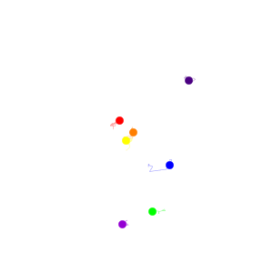
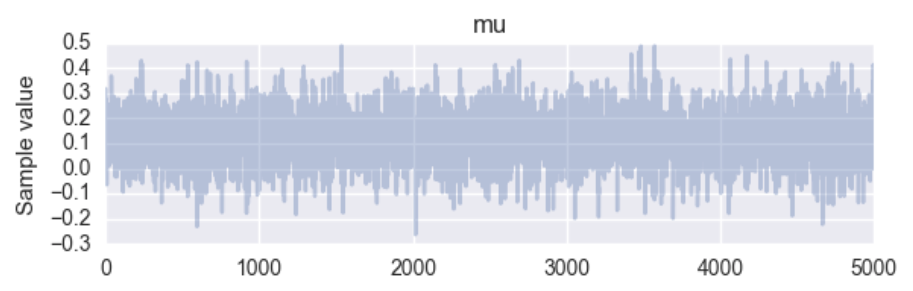
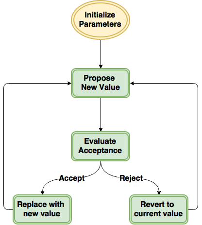
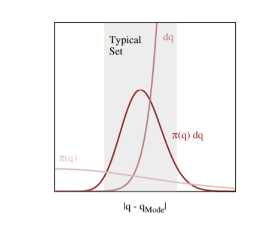
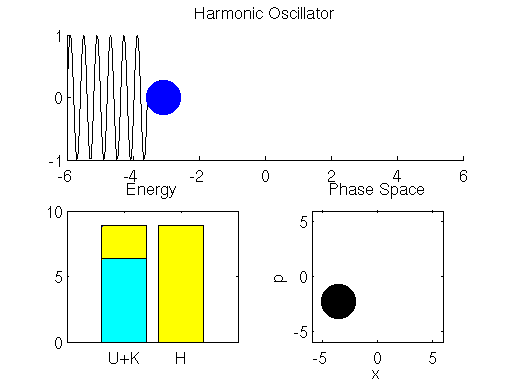

autoscale: true
theme: Letters from Sweden, 6

# Markov chain Monte Carlo

^
The main technical challenge in using Bayesian models resides in calculating the model's joint posterior distribution. 

---

# **Calculating Posteriors**

 
## [fit] $$Pr(\theta | y) = \frac{Pr(y|\theta) Pr(\theta)}{\int_{\theta} Pr(y|\theta) Pr(\theta) d\theta}$$

^
Obstacle!
- calculating posterior distributions is analytically impossible
- calculating them numerically is challenging

---

# Bayesian approximation

- Maximum *a posteriori* (MAP) estimate
- Laplace (normal) approximation
- Rejection sampling
- Importance sampling
- Sampling importance resampling (SIR)
- Approximate Bayesian Computing (ABC)
- Laplace Approximation

^
Variety of ways, adequacy depends on model and objectives

---

# MCMC

Markov chain Monte Carlo simulates a **Markov chain** for which some function of interest is the **unique, invariant, stationary** distribution.

^
**dependent** samples

---

# Markov chains

Stochastic process

$$\{X_t: t \in T\}$$

Markovian condition:

$$Pr(X_{t+1}=x_{t+1} | X_t=x_t, X_{t-1}=x_{t-1},\ldots,X_0=x_0) = Pr(X_{t+1}=x_{t+1} | X_t=x_t)$$

^
- MC is a special type of **stochastic process**. 
- ordered collection of random variables
- Markovian: mild non-independence

---

# Reversible Markov chains

When the Markov chain is constructed to satisfy the **detailed balance equation**:

$$\pi(x)Pr(y|x) = \pi(y) Pr(x|y)$$

The $$\pi$$ is the limiting distrbution of the chain.

^
*unique, invariant, stationary*

---

### Metropolis sampling

Repeat until convergence:

1.  Sample $$\theta^{\prime}$$ from $$q(\theta^{\prime} | \theta^{(t)})$$.

2.  Generate a Uniform[0,1] random variate $$u$$.

3.  Calculate acceptance probability:

$$a(\theta^{\prime},\theta) = \frac{\pi(\theta^{\prime})}{\pi(\theta)}$$

4.  If $$a(\theta^{\prime},\theta) > u$$ then
    $$\theta^{(t+1)} = \theta^{\prime}$$, otherwise
    $$\theta^{(t+1)} = \theta^{(t)}$$.

^
specification of the **scale parameter** for the random walk error

---

### Metropolis sampling

^
- workhorse algorithm
- performs poorly for larger models
- convergence issues
- requires tens/hundreds of thousands of iterations
- optimal acceptance rate is 24%

---

  
Most of the *probability* of a multivariate distribution lies in the 
# typical set
rather than near the mode.

[^*]: image: Betancourt 2017

^
- As the dimension of a model increases, this set moves progressively further from the mode, and becomes more singular, as the result of concentration of measure.
- typical set is a product of both the density, which is highest at the mode, and volume (that we integrate over), which increasingly becomes larger away from the mode as dimensionality increases. 
- at high dimensions, the region around the mode contributes almost nothing to the expectation. We need an algorithm that will find this narrow region and explore it efficiently.
- typical set is where draws from a given distribution tend to lie; it covers most of the mass of the distribution

---

# Hamiltonian Monte Carlo

Uses a *physical analogy* of a frictionless particle moving on a hyper-surface

Requires an *auxiliary variable* to be specified

- position (unknown variable value)
- momentum (auxiliary)

$$\mathcal{H}(s, \phi) = E(s) + K(\phi) = E(s) + \frac{1}{2}(\sum_i)\phi_i^2$$

^
Takes advantage of model gradient information to improve proposals
- emulates Hamitonian dynamics on a Euclidean manifold
- sum of potential and kinetic energy
- no more random walk!

---

## Hamiltonian Dynamics

 
$$\frac{ds_i}{dt} = \frac{\partial \mathcal{H}}{\partial \phi_i} = \phi_i$$
 
$$\frac{d\phi_i}{dt} = - \frac{\partial \mathcal{H}}{\partial s_i} = - \frac{\partial E}{\partial s_i}$$

^
- Transformation preserves volume and is reversible.
- The chain by itself is not ergodic , since simulating the dynamics maintains a
fixed Hamiltonian.
- HMC thus alternates Hamiltonian
dynamic steps, with Gibbs sampling of the velocity.

---

# Hamiltonian MC

1.  Sample a **new velocity** from univariate Gaussian
2.  Perform `n` **leapfrog steps** to obtain new state $$\theta^{\prime}$$
3.  Perform **accept/reject** move of $$\theta^{\prime}$$

^
- leapfrog steps discretize the continuous Hamiltonian dynamics

---

# Hamiltonian MC

---

# No U-Turn Sampler (NUTS)

*Hoffmann and Gelman (2014)*

^
- Extension of HMC that adaptively selects path lengths
- also sets leapfrog step size (epsilon)

---

^
From Hoffman and Gelman (2014)

